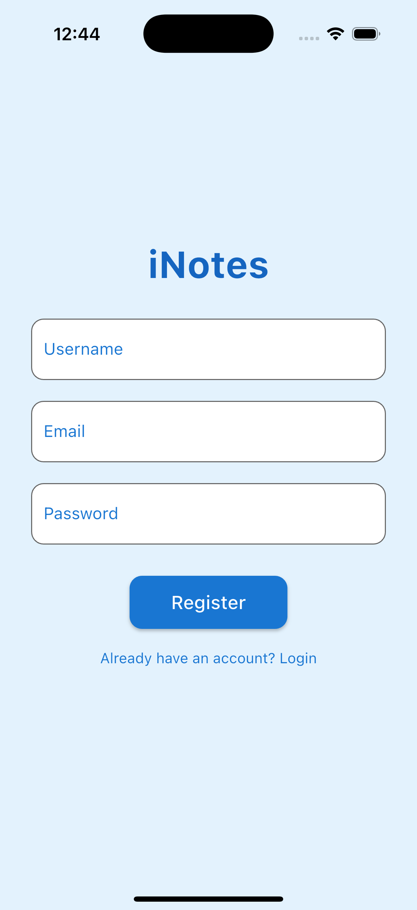
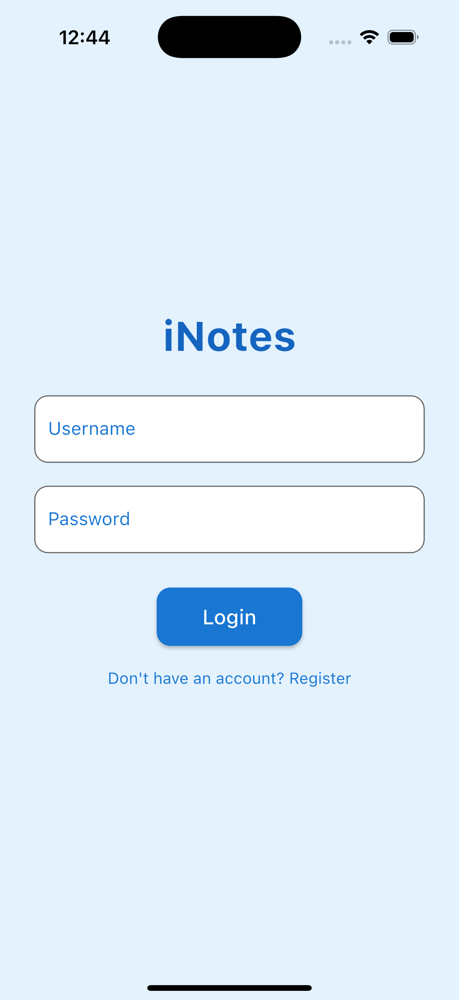

<div style="display: flex; flex-wrap: nowrap;">
    
    
     
    
    
    
    
    
    
    
</div>

# iNotes Project Setup

Follow the instructions below to set up and run the iNotes project.

## Clone the Repository

Open your terminal in VS Code and run the following command to clone the project:

```bash
git clone git@github.com:therasuldev/iNotes.git
```
## Navigate to the Project Directory
Change into the project directory:

```bash
cd iNotes
```

## Run the Backend
1. Navigate to the backend folder:
```bash
cd backend
```
2. Start the backend server using Cargo:
```bash
cargo run
```
## Run the Mobile Application
1. Open a new terminal in VS Code (select Terminal > New Terminal from the top menu).
2. Navigate to the mobile folder:
```bash
cd mobile
```
3. Use the appropriate command to run your mobile application:
```bash
flutter run  # or another command depending on your mobile framework
```   


